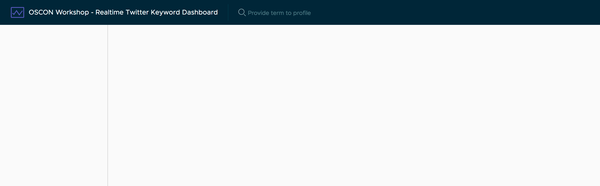

# Setting up Clarity

Clarity is the UI library in use for this project. While we've installed the Node package for Clarity we haven't imported into our Angular app. At the end of this step you'll have a basic app scaffolding to view.



## Include dependencies

Open up the `.angular-cli.json` file, and update the `scripts` and `styles` arrays to the following values. This will include the necessary CSS and JS dependencies.

```json
"styles": [
  "../node_modules/clarity-ui/clarity-ui.min.css",
  "../node_modules/clarity-icons/clarity-icons.min.css",
  "styles.css"
],
"scripts": [
  "../node_modules/mutationobserver-shim/dist/mutationobserver.min.js",
  "../node_modules/@webcomponents/custom-elements/custom-elements.min.js",
  "../node_modules/clarity-icons/clarity-icons.min.js"
],
```

You will need to restart `ng serve` for these changes to take effect.

## Add Clarity to app module

Open up `src/app/app.module.ts` and add two more imports to include the Clarity and Animations modules.

```typescript
import { BrowserAnimationsModule } from '@angular/platform-browser/animations';
import { ClarityModule } from 'clarity-angular';
```

Then you need to update the imports array to include these modules. Notice that the ClarityModule has a static method `forRoot()` to call, which initializes Clarity specifically root module (which is our app module).

```typescript
imports: [
  BrowserModule,
  FormsModule,
  HttpModule,
  BrowserAnimationsModule,
  ClarityModule.forRoot(),
],
```

This will now have enabled Clarity in your application for use.

## Base HTML scaffolding

Lastly, let's setup the basic app scaffolding, which lives in the `src/app/app.component.html` file.

```html
<div class="main-container">
  <header class="header header-6">
    <div class="branding">
      <a href="#" class="nav-link">
        <clr-icon shape="analytics"></clr-icon>
        <span class="title">OSCON Workshop - Realtime Twitter Keyword Dashboard</span>
      </a>
    </div>
    <form class="search">
      <label for="term">
        <input id="term" name="term" type="text" placeholder="Provide term to profile">
      </label>
    </form>
  </header>
  <div class="content-container">
    <div class="content-area"></div>
    <nav class="sidenav"></nav>
  </div>
</div>
```

You will see the Clarity styles apply to this page and this basic CSS styles format the app layout.
