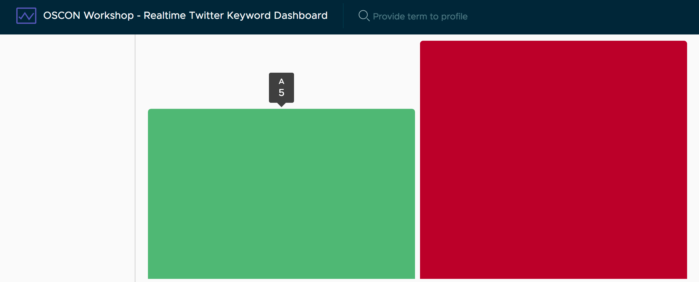

# Setting up NgxCharts

The role of NgxCharts is to provide a library that provides a set of components that generate charts. Rather than having to craft D3 charts ourselves, which is laborious, this library provides us that out of the box for certain types of charts.

This is what we'll be able to do after this step.



## Importing NgxCharts into the app

Like the previous libraries, we'll have to start by importing the NgxCharts module into our application. Add the following to your imports at the top of the `src/app/app.module.ts` file.

```typescript
import { NgxChartsModule } from '@swimlane/ngx-charts';
```

Now, to register this module with your application, you'll need to add it to the imports array of your NgModule like this.

```typescript
imports: [
  BrowserModule,
  FormsModule,
  HttpModule,
  BrowserAnimationsModule,
  ClarityModule.forRoot(),
  AngularFireModule.initializeApp(environment.config),
  NgxChartsModule,
],
```

That is all we need to do to make NgxCharts available to use, so let's go ahead and use it once to confirm.

## Adding a basic chart

Inside of the `src/app/app.component.html` file, update the div with the `content-area` class to contain a chart like you see here.

```typescript
<div class="content-area">
  <ngx-charts-bar-vertical
    [scheme]="{domain: ['#5AA454', '#A10A28']}"
    [results]="[{name: 'A', value: 5}, {name: 'B', value: 7}]">
  </ngx-charts-bar-vertical>
</div>
```

This should generate a bar chart with two bars in the right side of the screen like you saw in the image above.
