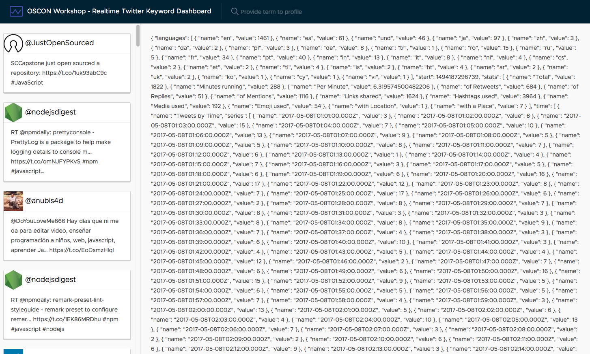

# Requesting aggregation data

In our Firebase database, there are multiple objects that we are tracking. So far we've seen the array of tweets, but there are three more.

* `aggregates` is an object containing nicely formatted counts and averages.
* `hashtags` is an array containing the list of hashtags and the frequency of their use.
* `links` is an array of links used in tweets and their frequency of use.

Since these are different, we'll have to create additional subscriptions to Firebase to request the relevant data.

## Request additional data

Since we have additional data, we need to make separate requests for the object `aggregates` and the `hashtags` and `links` lists. We'll create several methods to request this data, similar to the existing `loadTweets()` method.

Open `src/app/app.component.ts` and replace it with the following. This will create three new requests to load data from the database.

```typescript
import { Component, OnInit } from '@angular/core';
import { AngularFireDatabase } from 'angularfire2/database';

import { Tweet, Aggregates, Hashtag, Link } from './services/models';

@Component({
  selector: 'app-root',
  templateUrl: './app.component.html',
  styleUrls: ['./app.component.css']
})
export class AppComponent implements OnInit {
  loading: boolean = true;
  tweets: Tweet[];
  aggregates: Aggregates;
  hashtags: Hashtag[];
  links: Link[];

  constructor(private db: AngularFireDatabase) {}

  ngOnInit() {
    this.loading = true;
    this.loadTweets();
    this.loadAggregates();
    this.loadHashtags();
    this.loadLinks();
  }

  private loadTweets() {
    this.db.list('tweets', {
      query: {
        orderByChild: 'timestamp_ms',
        limitToLast: 100
      }
    }).subscribe(tweets => {
      this.tweets = tweets.sort((a, b) => b.timestamp_ms - a.timestamp_ms);
      this.loading = false;
    });
  }

  private loadAggregates() {
    this.db.object('/aggregates').subscribe(aggregates => {
      this.aggregates = aggregates;
    });
  }

  private loadHashtags() {
    this.db.list('hashtags', {
      query: {
        orderByChild: 'count',
        limitToLast: 100
      }
    }).subscribe(hashtags => {
      this.hashtags = hashtags.sort((a, b) => b.count - a.count);
    });
  }

  private loadLinks() {
    this.db.list('links', {
      query: {
        orderByChild: 'count',
        limitToLast: 100
      }
    }).subscribe(links => {
      this.links = links.sort((a, b) => b.count - a.count);
    });
  }
}
```

Let's bind that data into the template just to make sure we can see it coming through. Open up `src/app/app.component.html` and modify the template in the bottom div with the class `content-container`. It won't be pretty, but it will confirm it is being loaded.

```html
<div class="content-container" *ngIf="tweets?.length">
  <div class="content-area">
    <div>{{aggregates | json}}</div>
    <div>{{hashtags | json}}</div>
    <div>{{links | json}}</div>
  </div>
  <nav class="sidenav">
    <app-tweets *ngFor="let tweet of tweets" [tweet]="tweet"></app-tweets>
  </nav>
</div>
```

At this point, you should see various JSON appearing in the main column of the application.

