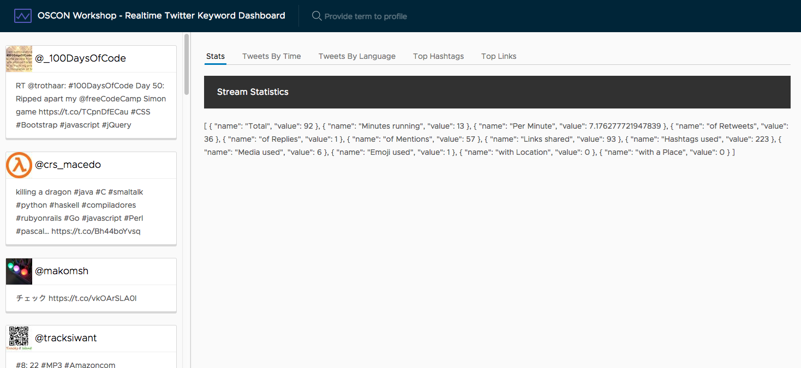

# Set up tabs

Before we create all of our stats components, we want to have them appear inside of tabs. We'll use the Clarity UI library tabs components to make this very easy.

Open up `src/app/app.component.html` and update the second div with the class `content-container` as you see here.

```html
<div class="content-container" *ngIf="tweets?.length && aggregates?.languages?.length">
  <div class="content-area">
    <clr-tabs>
    <clr-tab-link>Stats</clr-tab-link>
    <clr-tab-link>Tweets by Time</clr-tab-link>
    <clr-tab-link>Tweets by Language</clr-tab-link>
    <clr-tab-link>Top Hashtags</clr-tab-link>
    <clr-tab-link>Top Links</clr-tab-link>

    <clr-tab-content>
      <header class="header header-1 chart-header"><div class="branding"><span class="title">Stream Statistics</span></div></header>
      {{aggregates?.stats | json}}
    </clr-tab-content>

    <clr-tab-content>
      <header class="header header-1 chart-header"><div class="branding"><span class="title">Tweets by Time</span></div></header>
      {{aggregates?.time | json}}
    </clr-tab-content>

    <clr-tab-content>
      <header class="header header-1 chart-header"><div class="branding"><span class="title">Tweets by Language</span></div></header>
      {{aggregates?.languages | json}}
    </clr-tab-content>

    <clr-tab-content>
      <header class="header header-1 chart-header"><div class="branding"><span class="title">Top Hashtags</span></div></header>
      {{hashtags | json}}
    </clr-tab-content>

    <clr-tab-content>
      <header class="header header-1 chart-header"><div class="branding"><span class="title">Top Links</span></div></header>
      {{links | json}}
    </clr-tab-content>
    </clr-tabs>
  </div>
  <nav class="sidenav">
    <app-tweets *ngFor="let tweet of tweets" [tweet]="tweet"></app-tweets>
  </nav>
</div>
```

The result should be a set of tabs with JSON content displayed as you select different tabs.

