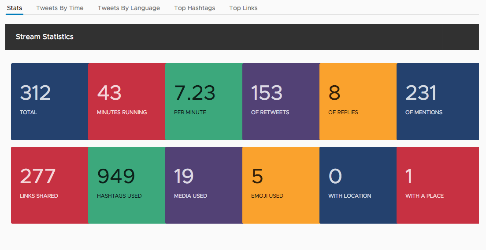

# Stats component

Now we'll get to creating some of the components that will render out various charts. We'll use a chart with a set of cards, each showing a primary metric and label.

Right now our component looks like this as a tab with a title and raw data.


## Generate the component

Using the CLI, we will generate a new component to handle the display of our stats

```bash
ng generate component stats
```

You'll now see a new directory in `src/app/stats` with the files for the new component, and it will already be registered with the application.

## Setup input bindings

Just like our Tweets component, we will need to create an input binding so the data can be passed to the Stats component from the App component.

Open up the `src/app/stats/stats.component.ts` file and replace the contents with the following.

```typescript
import { Component, Input } from '@angular/core';

@Component({
  selector: 'app-stats',
  templateUrl: './stats.component.html',
  styleUrls: ['./stats.component.css']
})
export class StatsComponent {
  @Input() stats;
}
```

## Add template with chart

Now that data is able to be bound into the component, we need to display the chart. Here we'll add the NgxCharts Number Card chart into the component.

Open up `src/app/stats/stats.component.html` and replace its contents with the following.

```html
<ngx-charts-number-card
  [scheme]="{domain: ['#24416E', '#C73142', '#3CA87C', '#524175', '#FAA22D']}"
  [results]="stats"
  [emptyColor]="'#fff'">
</ngx-charts-number-card>
```

These chart components consume the data in the `results` property, and the other properties are for how it should be styled.

## Add CSS for chart display

For the chart to display properly, we need to make sure the Stats component itself is a block element. Custom elements don't necessarily get the proper CSS to make it a block element, and we'll also give it a specific height so the chart can autosize to the available space.

Open up `src/app/stats/stats.component.css` and add the following.

```css
:host {
  height: 400px;
  display: block;
}
```

## Update App component

Lastly, we want to add the component to our App component template in place of the current JSON object. Update the tab inside of the `src/app/app.component.html` file to use the new Stats component.

```html
<clr-tab-content>
  <header class="header header-1 chart-header">
    <div class="branding"><span class="title">Stream Statistics</span></div>
  </header>
  <app-stats [stats]="aggregates?.stats" *ngIf="aggregates?.stats"></app-stats>
</clr-tab-content>
```

Once everything is saved, you should now see the stats component in the page.

