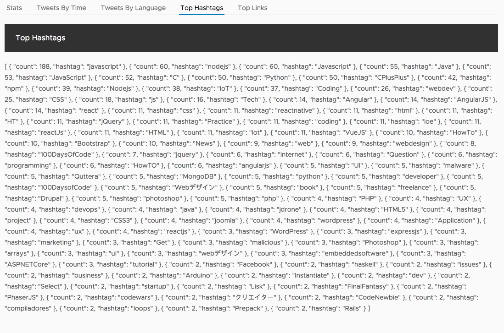
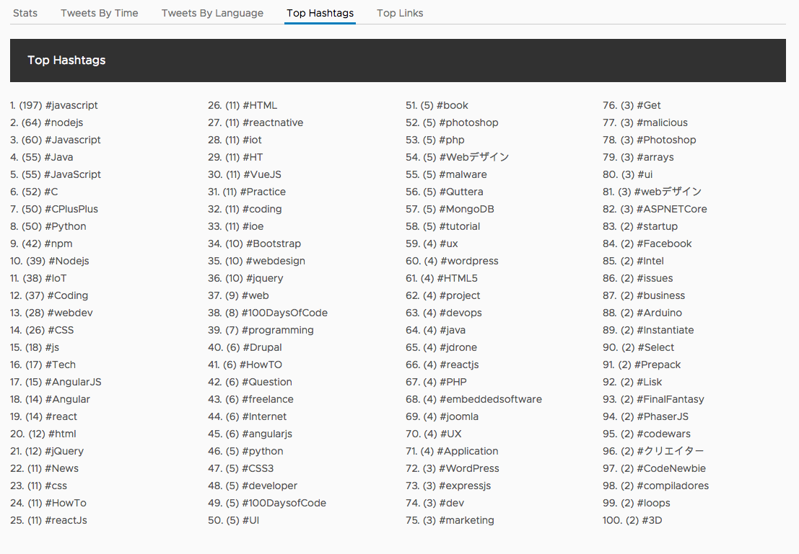

# Top hashtags component

The top hashtags component will not display a chart, but rather show the top 100 hashtags for a term and the number of uses.

Currently, the Top Hashtags tab has the JSON data.



## Generate the component

Yet again, we start by making a component.

```bash
ng generate component hashtags
```

We now have a new directory in `src/app/hashtags` with the generated files.

## Setup input bindings

We'll be just displaying a list of hashtags, so we need to setup the input binding for the hashtags data from Firebase.

Open up the `src/app/hashtags/hashtags.component.ts` file and replace the contents with the following.

```typescript
import { Component, Input } from '@angular/core';

@Component({
  selector: 'app-hashtags',
  templateUrl: './hashtags.component.html',
  styleUrls: ['./hashtags.component.css']
})
export class HashtagsComponent {
  @Input() hashtags;
}
```

## Add template with list

This is just a basic array of hashtag and counts, so we'll just create a template that has an order list and iterate over all of the hashtags to display them.

Open up `src/app/hashtags/hashtags.component.html` and replace its contents with the following.

```html
<ol>
  <li *ngFor="let hashtag of hashtags">({{hashtag.count}}) #{{hashtag.hashtag}}</li>
</ol>
```

## Add CSS

With a little CSS, we can have the list of hashtags layout into columns nicely to save on vertical space.

Open up `src/app/hashtags/hashtags.component.css` and add the following.

```css
ol {
    -moz-column-count: 4;
    -moz-column-gap: 20px;
    -webkit-column-count: 4;
    -webkit-column-gap: 20px;
    column-count: 4;
    column-gap: 20px;
}
```

## Update App component

We just need to update the App component to use the new Hashtags component. Open the the `src/app/app.component.html` file and modify the contents of the hashtags tab.

```html
<clr-tab-content>
  <header class="header header-1 chart-header">
    <div class="branding"><span class="title">Top Hashtags</span></div>
  </header>
  <app-hashtags [hashtags]="hashtags" *ngIf="hashtags"></app-hashtags>
</clr-tab-content>
```

The list of hashtags should now appear!

