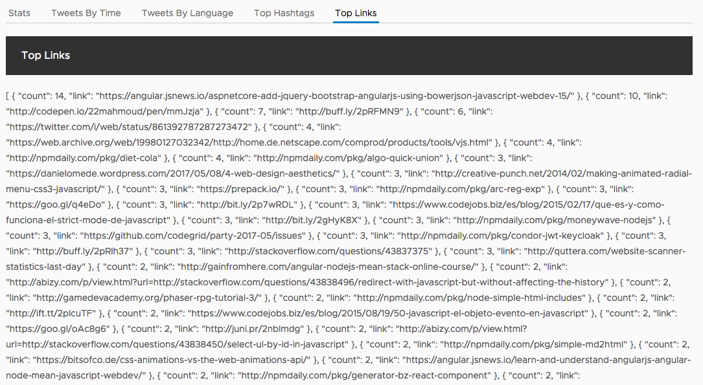
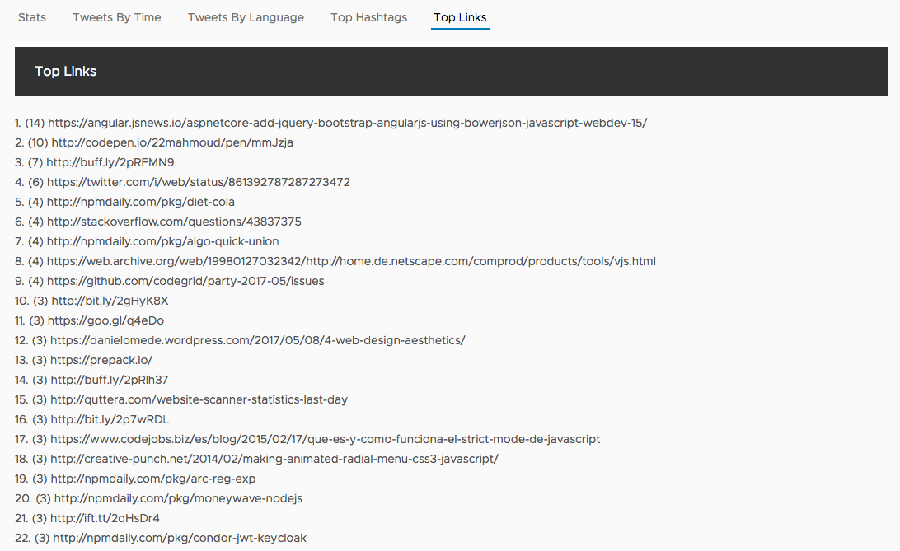

# Top links component

The top links component is nearly identical to the top hashtags component, but shows us different interesting data about what links are most shared.

So far, it just displays JSON data.



## Generate the component

If you aren't too tired of it yet, create one last component.

```bash
ng generate component links
```

Voilla, there is a new directory at `src/app/links`.

## Setup input bindings

Since its also just a display of a list of items, we just need a simple input binding to pass the data from the App component.

Open up the `src/app/links/links.component.ts` file and replace the contents with the following.

```typescript
import { Component, Input } from '@angular/core';

@Component({
  selector: 'app-links',
  templateUrl: './links.component.html',
  styleUrls: ['./links.component.css']
})
export class LinksComponent {
  @Input() links;
}
```

## Add template with list

Just like the hashtags, we'll just iterate over the list of links and display them with a count.

Open up `src/app/links/links.component.html` and replace its contents with the following.

```html
<ol>
  <li *ngFor="let link of links">({{link.count}}) {{link.link}}</li>
</ol>
```

## Update App component

We just need to update the App component to use the new Links component. Open the the `src/app/app.component.html` file and modify the contents of the links tab.

```html
<clr-tab-content>
  <header class="header header-1 chart-header">
    <div class="branding"><span class="title">Top Links</span></div>
  </header>
  <app-links [links]="links" *ngIf="links"></app-links>
</clr-tab-content>
```

Hooray, the list of links now appears!

