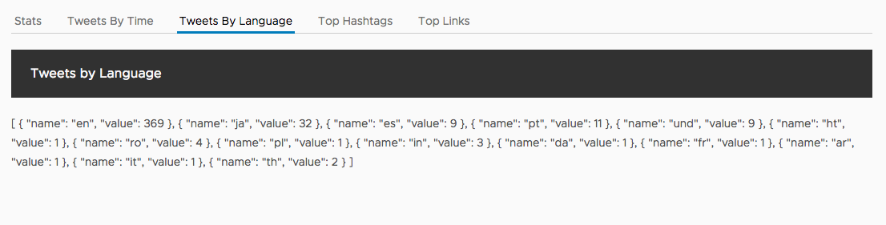
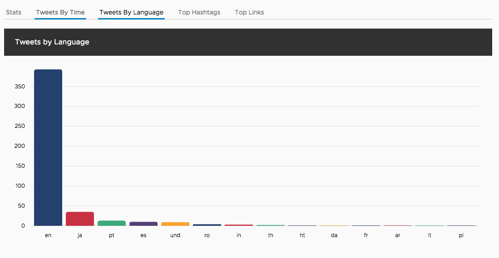

# Tweets by language component

Our middle tab is to show a bar chart with the various languages used to send tweets and what the most popular languages are.

Currently, the Tweets by language tab looks something like this.



## Generate the component

See the pattern? Create the component like so.

```bash
ng generate component languages
```

No surprise, there is a new directory in `src/app/languages` with the generated files.

## Setup input bindings

The bar chart will consume data like all the others, so we'll add an input binding to pass the data from the App component into the Languages component. We also will sort the list of languages so they are ordered by most to least used.

Open up the `src/app/languages/languages.component.ts` file and replace the contents with the following.

```typescript
import { Component, Input, OnChanges } from '@angular/core';

@Component({
  selector: 'app-languages',
  templateUrl: './languages.component.html',
  styleUrls: ['./languages.component.css']
})
export class LanguagesComponent implements OnChanges {
  @Input() languages;

  ngOnChanges() {
    this.languages.sort((a, b) => (b.value - a.value));
  }
}
```

## Add template with chart

The bar chart has both a vertical and horizontal option, and here we've opted for the vertical. We define a number of the properties for specifying the types of styles we wish the chart to have, and pass the languages data into the `results` property.

Open up `src/app/languages/languages.component.html` and replace its contents with the following.

```html
<ngx-charts-bar-vertical
    [scheme]="{ domain: ['#24416E', '#C73142', '#3CA87C', '#524175', '#FAA22D'] }"
    [results]="languages"
    [xAxis]="true"
    [yAxis]="true"
    [showXAxisLabel]="true"
    [showYAxisLabel]="true"
    [xAxisLabel]="'Language'"
    [yAxisLabel]="'Tweets'">
</ngx-charts-bar-vertical>
```

## Add CSS for chart display

Again, we need to give the Languages component a block display and height for the chart to size properly.

Open up `src/app/languages/languages.component.css` and add the following.

```css
:host {
  height: 400px;
  display: block;
}
```

## Update App component

The last step is to update the App component to display the Languages component. Open the the `src/app/app.component.html` file and modify the contents of the languages tab.

```html
<clr-tab-content>
  <header class="header header-1 chart-header">
    <div class="branding"><span class="title">Tweets by Language</span></div>
  </header>
  <app-languages [languages]="aggregates?.languages" *ngIf="aggregates?.languages"></app-languages>
</clr-tab-content>
```

The bar shart should now display the list of languages and the number of tweets in that language.

