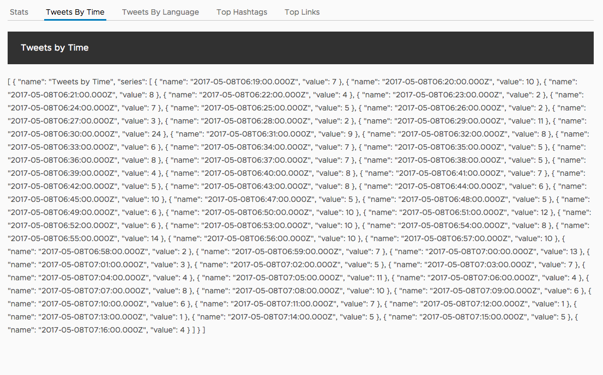
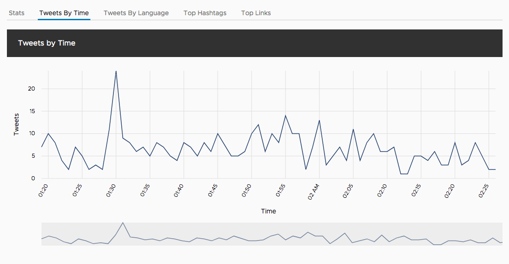

# Tweets by time component

Our next tab is to show a line chart with the number of tweets aggregated by the minute. This gives us an indication of the term's popularity over time.

If you view the Tweets by Time tab, it looks like this.



## Generate the component

Again, we'll generate the new component using the CLI.

```bash
ng generate component time
```

As you might expect, there is a new directory in `src/app/time` with the files.

## Setup input bindings

We'll setup an input binding to get the data, but because this data is also a timeseries chart we'll need to ensure that the x axis is formatted as a date. That will allow our chart to understand what time the data points are at, and enable a nice timeline selector.

Open up the `src/app/time/time.component.ts` file and replace the contents with the following.

```typescript
import { Component, Input, OnChanges } from '@angular/core';

@Component({
  selector: 'app-time',
  templateUrl: './time.component.html',
  styleUrls: ['./time.component.css']
})
export class TimeComponent implements OnChanges {
  @Input() time;

  ngOnChanges() {
    if (this.time && this.time[0] && this.time[0] && this.time[0].series && this.time[0].series.length) {
      this.time[0].series.map(minute => {
        minute.name = new Date(minute.name);
        return minute;
      });
    }
  }
}
```

## Add template with chart

We want to use a different chart type here, so we'll create a line chart since this data is linear and over time. This chart component has more options, so many of them are turned on to make the chart appear as we wish.

Open up `src/app/time/time.component.html` and replace its contents with the following.

```html
<ngx-charts-line-chart
    [scheme]="{ domain: ['#24416E'] }"
    [results]="time"
    [xAxis]="true"
    [yAxis]="true"
    [timeline]="true"
    [roundDomains]="true"
    [showXAxisLabel]="true"
    [showYAxisLabel]="true"
    [xAxisLabel]="'Time'"
    [yAxisLabel]="'Tweets'">
</ngx-charts-line-chart>
```

It will consume the time data that is bound into the component, and chart it out.

## Add CSS for chart display

Just like the other chart, we need to give the Time component a block display and height for the chart to size properly.

Open up `src/app/time/time.component.css` and add the following.

```css
:host {
  height: 400px;
  display: block;
}
```

## Update App component

Now to get the Time component to display, we need to update the Tweets by time tab with the following in the `src/app/app.component.html` file.

```html
<clr-tab-content>
  <header class="header header-1 chart-header">
    <div class="branding"><span class="title">Tweets by Time</span></div>
  </header>
  <app-time [time]="aggregates?.time" *ngIf="aggregates?.time"></app-time>
</clr-tab-content>
```

You should now see the Tweets by time component charting the tweets over time.

