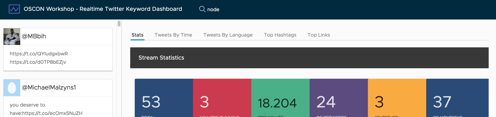

# Term component

In order to manage the current term, we'll create one more component that will be in charge of the controls for displaying the current term and handling how changes are submitted.

Create a new component by running the CLI command.

```bash
ng generate component term
```

## Add template

Now that we have the component, we can add the template for it. Clarity provides us some nice styling for a text box in the navbar, so we'll use it and the `ngModel` binding to create a form control.

Open up `src/app/term/term.component.html` and replace it with the following.

```html
<form class="search">
  <label for="term">
    <input id="term" name="term" type="text" placeholder="Provide term to profile" [(ngModel)]="term" (keyup)="onKeyUp($event)">
  </label>
</form>

```

## Setup controller

The final step is to wire up the controller. The first thing is to import the `TermService` and also make sure to add it to the `providers` array. This makes the service ready to consume in the controller.

Then we create a class that stores injects the `TermService`, loads the current term on load, and has a couple of methods to handle setting the term.

Open up `src/app/term/term.component.ts` and replace its contents with the following.

```typescript
import { Component, OnInit } from '@angular/core';

import { TermService } from '../services/term.service';

@Component({
  selector: 'app-term',
  templateUrl: './term.component.html',
  styleUrls: ['./term.component.css'],
  providers: [ TermService ]
})
export class TermComponent implements OnInit {
  term: string = '';

  constructor(private termService: TermService) {}

  ngOnInit() {
     this.getTerm();
  }

  private getTerm() {
    this.termService.getTerm().subscribe(response => {
      this.term = response.json().term;
    });
  }

  private changeTerm() {
    this.termService.setTerm(this.term).subscribe(response => {
      this.term = response.json().term;
    });
  }

  onKeyUp(event) {
    if (event.keyCode.toString() === '13') {
      this.changeTerm();
    }
  }
}
```

## Add term component to App component

The last step is to add the Term component so it gets rendered. Open up `src/app/app.component.html` and update the header code like you see here.

```html
<header class="header header-6">
  <div class="branding">
    <a href="#" class="nav-link">
      <clr-icon shape="analytics"></clr-icon>
      <span class="title">OSCON Workshop - Realtime Twitter Keyword Dashboard</span>
    </a>
  </div>
  <app-term></app-term>
</header>
```

The component should appear in the navbar and show the current term.

