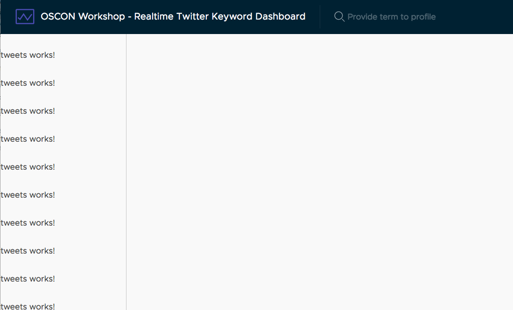

# Bind data into the Tweets component

Now that we have a new component, we need to make the tweets data available to it from the App component. This is done through property bindings, which is a way to "bind" data from one component into another.

## Setup Tweets component to accept bindings

Components need to declare what properties they can accept data, or Angular won't be able to properly manage the data from one component to the next. This is simple to do, by simply declaring a property on the component controller and giving it a special decorator.

Open up `src/app/tweets/tweets.component.ts` and replace it with the following.

```typescript
import { Component, Input } from '@angular/core';
import { Tweet } from '../services/models';

@Component({
  selector: 'app-tweets',
  templateUrl: './tweets.component.html',
  styleUrls: ['./tweets.component.css']
})
export class TweetsComponent {
  @Input() tweet: Tweet;
}
```

This defines that the Tweets component will accept a binding on the `tweets` attribute. Since it will simply display the data it is given, this makes the Tweets component a fairly simple component.

## Bind data from App component to Tweets component

Now the tweets data is actually loaded in the App component, so we need to pass that data into the Tweets component through the input binding. Also since we have an array of tweets, we'll want to iterate over the list and display a Tweets component for each tweet.

Open up `src/app/app.component.html` and update the sidenav near the bottom of the file.

```html
<nav class="sidenav">
  <app-tweets *ngFor="let tweet of tweets" [tweet]="tweet"></app-tweets>
</nav>
```

Here we've used the `ngFor` directive to loop over the list of tweets being stored on the `tweets` property of the App component. Then we use `[tweet]="tweet"` to bind the individual tweets into the component.

The application should appear with a list of `tweets works!` on the sidenav.

