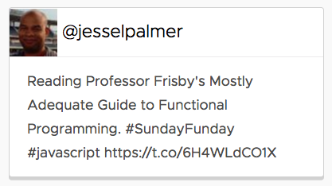
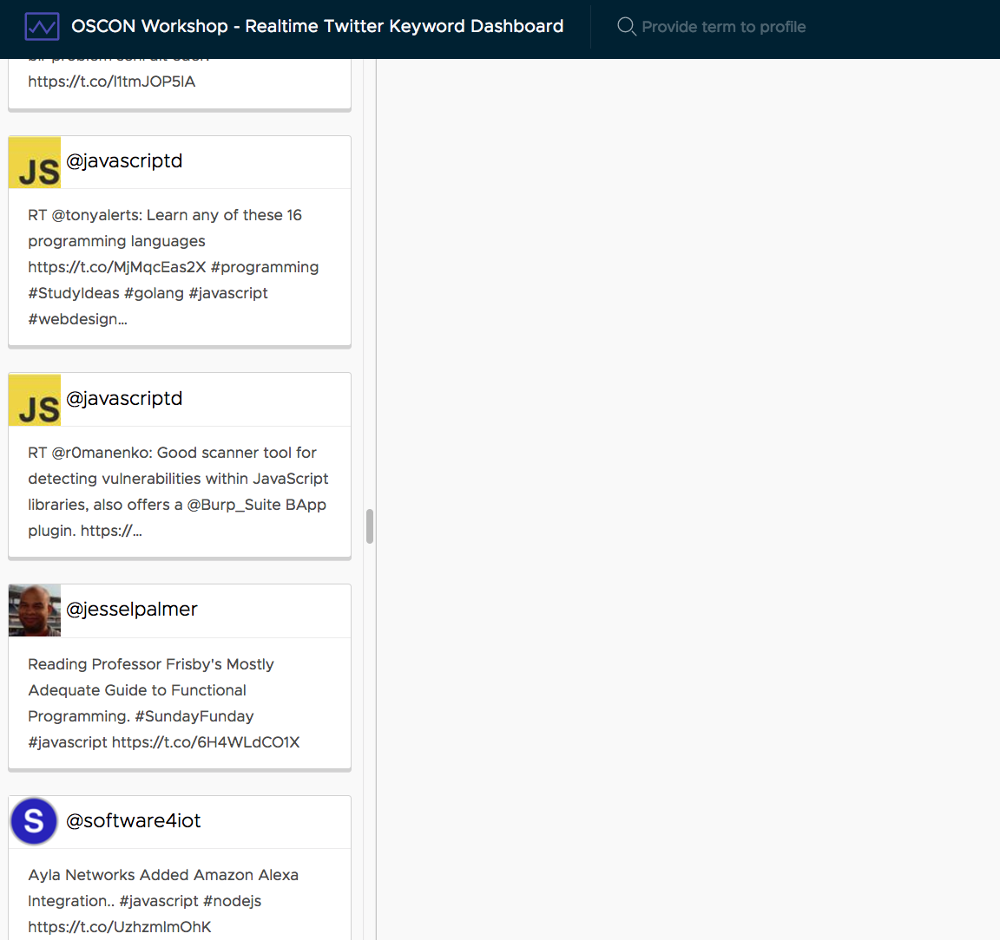

# Displaying tweets

We need to update the Tweets component template in order to display the actual tweet data in a nice format like you see here.



We'll achieve this by updating the CSS and template of the Tweets component. Start by opening up the `src/app/tweets/tweets.component.html` file and replacing its contents with the following.

```html
<div class="card">
  <div class="card-header">
     @{{tweet.user.screen_name}}
  </div>
  <div class="card-block">
    {{tweet.text}}
  </div>
</div>
```

Here we display and bind a few properties into the template. Notice the use of `[src]` to bind to the source URL for the image.

Now open up `src/app/tweets/tweets.component.css` and add the following styles.

```css
.card-header {
  padding: 0;
}
```

Lastly, we want to add some CSS to the App component to allow the sidenav to scroll. Open `src/app/app.component.css` and add the following styles.

```css
:host .sidenav {
  padding: 0 10px;
  overflow-y: scroll;
  min-width: 350px;
  max-width: 450px;
}
.chart-header {
  margin: 20px 0;
}
.spinner-container {
  text-align: center;
}
```

The final result is that page should show a stream of tweets similar to this. As new tweets arrive, the new ones should automatically render at the top of the list.



