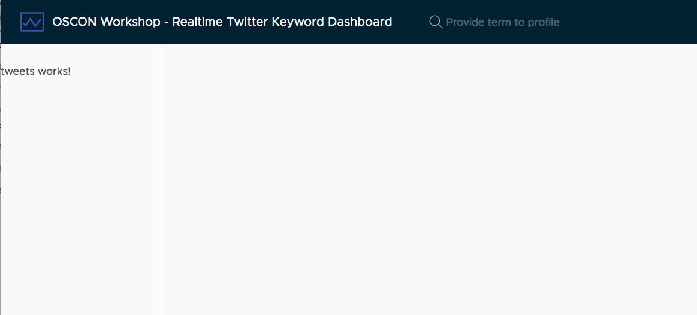

# Generate the component

Now we have data coming into the application, we want to create a component that will handle the display of that data. We _could_ put everything into the App component itself, but it is better to separate these individual features out so they can be isolated.

## Use the CLI to create a component

The Angular CLI has a way to generate new components, so you can have the basic scaffolding created for you. Run the following command to get a new component.

```bash
ng generate component tweets
```

This will create a new folder at `src/app/tweets` with new files for the component, and automatically ensure it is setup properly to consume inside the app.

You can then update the App component template to consume this component by editing `src/app/app.components.html` and updating near the bottom. You'll see a new message in the sidebar that says 'tweets works!', assuming the stream is going.

```html
<div class="content-container" *ngIf="tweets?.length">
  <div class="content-area"></div>
  <nav class="sidenav">
    <app-tweets></app-tweets>
  </nav>
</div>
```

