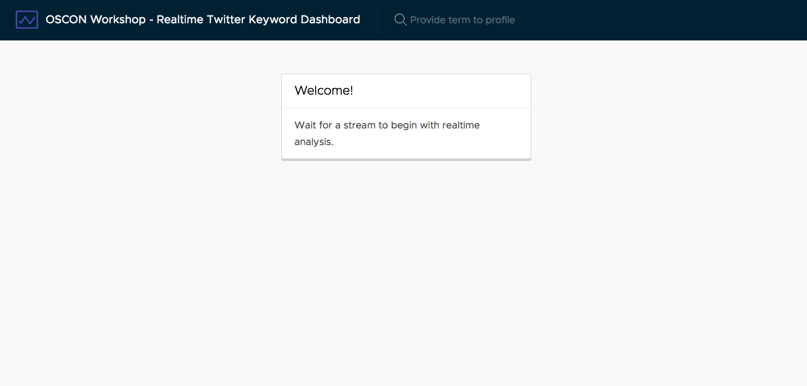
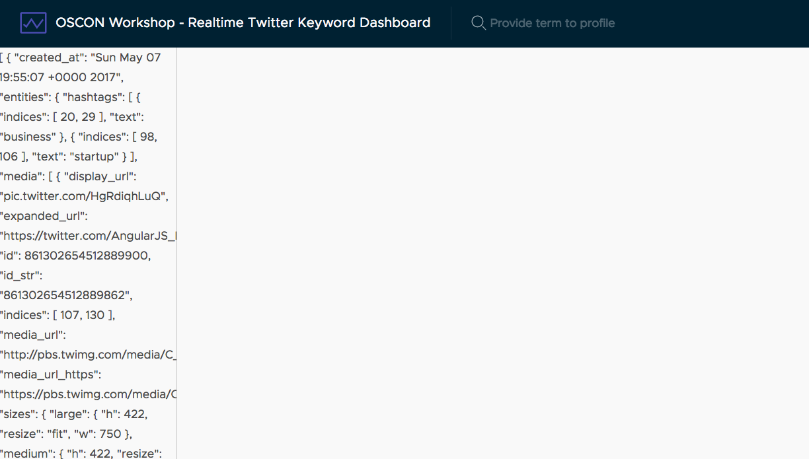

# Request data from Firebase

First, we need to get the data from Firebase into our Angular application. We already demonstrated that the connection is working, but now we need to wire it up to load the list of tweets.

> It is assumed you have an active stream running. If you are running your own server, you will need to make sure a stream has been started. See [this guide](../server/starting-a-stream.md) for help.

## Creating interfaces for objects

While this is optional, it is very useful to both TypeScript and anyone who works on this application to know what data structures to expect when we get data back from Firebase.

Create a new file at `src/app/services/models.ts` and add the following interfaces. The interfaces describe values from the data that comes back from the Twitter API. I've omitted some properties that we don't care about for this demo. See more about the Twitter API and the entities at https://dev.twitter.com/overview/api.

```typescript
interface User {
  description: string;
  favourites_count: number;
  followers_count: number;
  friends_count: number;
  id: number;
  lang: string;
  listed_count: number;
  location: string;
  name: string;
  profile_image_url: string;
  profile_image_url_https: string;
  screen_name: string;
  statuses_count: number;
}

export interface Tweet {
  created_at: string;
  favorite_count: number;
  id: number;
  lang: string;
  retweet_count: number;
  text: string;
  timestamp_ms: number;
  user: User;
}

interface DataPoint {
  name: string;
  value: number|string;
}

interface Series {
  name: string;
  series: DataPoint[];
}

export interface Aggregates {
  languages: DataPoint[];
  time: Series;
  stats: DataPoint[];
}

export interface Hashtag {
  hashtag: string;
  count: number;
}

export interface Link {
  link: string;
  count: number;
}
```

If you are new to TypeScript interfaces, think of them as a way to describe the properties of a complex object. This is a major benefit to using TypeScript, as you can get code hinting, better validation, and other goodies from defining these properties.

## Request the list of tweets

We'll put all of our requests for data in the App component, and later on we'll pass that data into other components as needed. Using the Angularfire library, we can easily query the list of tweets and have it sort out by the latest ones. In this example, we only want to show the last 100, because there is a cost to rendering elements and 100 is a fairly good sample.

Open up `src/app/app.component.ts` and replace its contents with the following.

```typescript
import { Component, OnInit } from '@angular/core';
import { AngularFireDatabase } from 'angularfire2/database';

import { Tweet } from './services/models';

@Component({
  selector: 'app-root',
  templateUrl: './app.component.html',
  styleUrls: ['./app.component.css']
})
export class AppComponent implements OnInit {
  loading: boolean = true;
  tweets: Tweet[];

  constructor(private db: AngularFireDatabase) { }

  ngOnInit() {
    this.loading = true;
    this.loadTweets();
  }

  private loadTweets() {
    this.db.list('tweets', {
      query: {
        orderByChild: 'timestamp_ms',
        limitToLast: 100
      }
    }).subscribe(tweets => {
      this.tweets = tweets.sort((a, b) => b.timestamp_ms - a.timestamp_ms);
      this.loading = false;
    });
  }
}

```

This will load the list of tweets when the component is initialized, and also set properties for us to check if the data is loading or not.

Now open up `src/app/app.component.html` and update the div with the class `content-container` to the following. This will show a loading screen while tweets are being loaded, and then later we'll update it to display the list of tweets on the left column when ready.

```html
<div class="content-container" *ngIf="!tweets?.length">
  <div class="content-area">
    <div class="row">
      <div class="col-xs-4 offset-xs-4">
        <div class="spinner-container" *ngIf="loading">
          <div class="spinner">Loading...</div>
        </div>
        <div class="card" *ngIf="!loading">
          <div class="card-header">Welcome!</div>
          <div class="card-block">Wait for a stream to begin with realtime analysis.</div>
        </div>
      </div>
    </div>
  </div>
</div>
<div class="content-container" *ngIf="tweets?.length">
  <div class="content-area"></div>
  <nav class="sidenav">{{tweets | json}}</nav>
</div>
```

It should appear like you see in the following then.



## Starting the stream

If you haven't already done so, this is the time to [start a stream](../server/starting-a-stream.md). The application will automatically detect when new tweets start to come in (hence the realtime nature of Firebase), and display a JSON array of the tweets in the side column!

